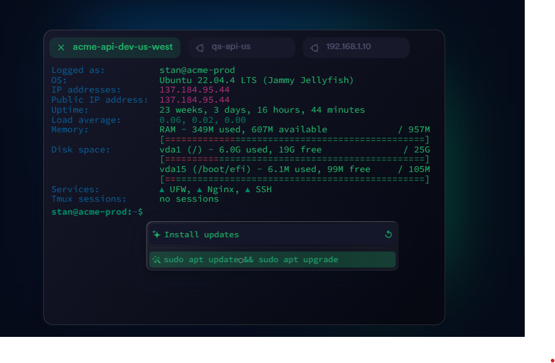

# ScreammSSH - Modern SSH/SFTP-klient

En modern SSH-klient byggd med Electron, React och TypeScript. ScreammSSH erbjuder en användarvänlig gränssnitt för SSH-anslutningar, filöverföring via SFTP och flera teman för en anpassad upplevelse.



## Funktioner

- **SSH Terminal**: Anslut till servrar via SSH med lösenord eller nycklar
- **SFTP Filhantering**: Bläddra, ladda upp, ladda ner och redigera filer på fjärrservrar
- **Temastöd**: Välj mellan flera retro-temade gränssnitt 
- **Sparade anslutningar**: Spara dina anslutningsuppgifter för snabb åtkomst
- **Kommandohistorik**: Åtkomst till tidigare använda kommandon

## Teman

ScreammSSH kommer med följande teman:

1. **Standard**: Modernt mörkt tema
2. **Nostromo (Röd)**: Inspirerat av ALIEN-filmerna med röd text på svart bakgrund
3. **Klassisk Terminal (Grön)**: Traditionell grön text på svart bakgrund
4. **Htop (Lila)**: Lila text på mörk bakgrund, inspirerat av systemövervakare
5. **Cyan SSH**: Cyan/blå text på mörk bakgrund

Byt tema genom att klicka på temaväljarknapparna i appens övre del.

## Installation och utveckling

### Förutsättningar
- Node.js (v14+)
- npm eller yarn

### Installation

```bash
# Klona repositoryt
git clone https://github.com/your-username/screamm-ssh.git
cd screamm-ssh

# Installera beroenden
npm install

# Starta utvecklingsversionen
npm start
```

### Skapa en installationsfil

```bash
# Skapa en distributionspaket för din plattform
npm run make
```

## Felsökning

### Kända problem och lösningar

1. **Anslutningsproblem**
   - Kontrollera att du har korrekt host, port, användarnamn och lösenord/nyckel
   - Kontrollera att servern är nåbar (ping, telnet)
   - Se över eventuella brandväggsinställningar

2. **Node Native Module Error**
   - Om du får problem med nativa moduler (särskilt ssh2), installera byggverktyg:
     ```
     npm install --global windows-build-tools  # För Windows
     ```
   - Eller ominstallera node-modulerna:
     ```
     rm -rf node_modules
     npm install
     ```

3. **Teman fungerar inte**
   - Kontrollera att du har de senaste versionerna av alla beroenden
   - Rensa cachad data genom att ta bort följande mapp:
     - Windows: `%APPDATA%\screamm-ssh-config`
     - macOS: `~/Library/Application Support/screamm-ssh-config`
     - Linux: `~/.config/screamm-ssh-config`

4. **SFTP-fel**
   - Kontrollera att din användare har behörighet till filerna/mapparna
   - Vissa servrar begränsar SFTP-åtkomst till specifika mappar

## Licens

MIT

## Bidra

Bidrag välkomnas! Öppna ett issue eller skicka en pull request. 